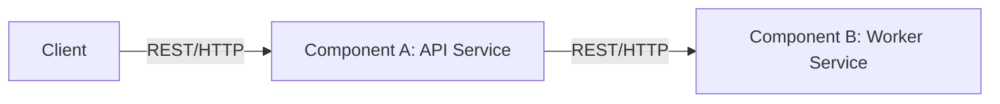

# CloudLab-Ready
# Project Deliverable 1 Repo

Resume: [resume/TyrellEnglish-Resume (2).pdf](resume/TyrellEnglish-Resume (2).pdf)

## Vision
Diagram of the two components and how they communicate:

## Proposal
Base images (initial plan):
- API service: `python:3.12-slim`
- Worker service: `node:20-alpine`

Reasoning:
- I chose Python for the API because I am most comfortable with it and it has great support for the rest of the services.
- Small, lightweight images
- Fast builds and installs
- Easy to deploy and run on CloudLab

