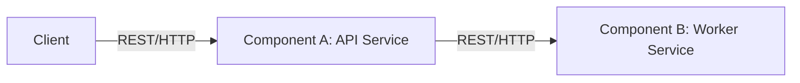

# CloudLab-Ready
# Project Deliverable 2 Repo

Resume: [resume/TyrellEnglish-Resume (2).pdf](resume/TyrellEnglish-Resume (2).pdf)

## Vision
Diagram of the two components and how they communicate:


```mermaid
flowchart LR
  C[Client] -- REST/HTTP --> A[Component A: API Service]
  A -- REST/HTTP --> B[Component B: Worker Service]
```
## Proposal
Base images (initial plan):
- API service: `python:3.12-slim`
- Worker service: `node:20-alpine`

Reasoning:
- I chose Python for the API because I am most comfortable with it and it has great support for the rest of the services.
- Small, lightweight images
- Fast builds and installs
- Easy to deploy and run on CloudLab


## Build Process

This project uses Docker Compose to build and run two services:

- `api` – a FastAPI-based Python service
- `worker` – a Node.js worker service

The `docker-compose.yml` file builds both containers and starts them together.

### API Container Build

The API Dockerfile uses these instructions:

```dockerfile
FROM python:3.12-slim
WORKDIR /app
RUN pip install --no-cache-dir fastapi uvicorn
COPY ./src /app/src
EXPOSE 8080
CMD ["uvicorn", "src.main:app", "--host", "0.0.0.0", "--port", "8080"]


